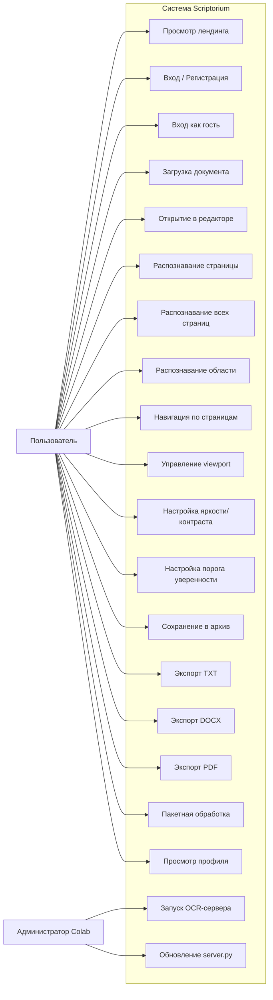
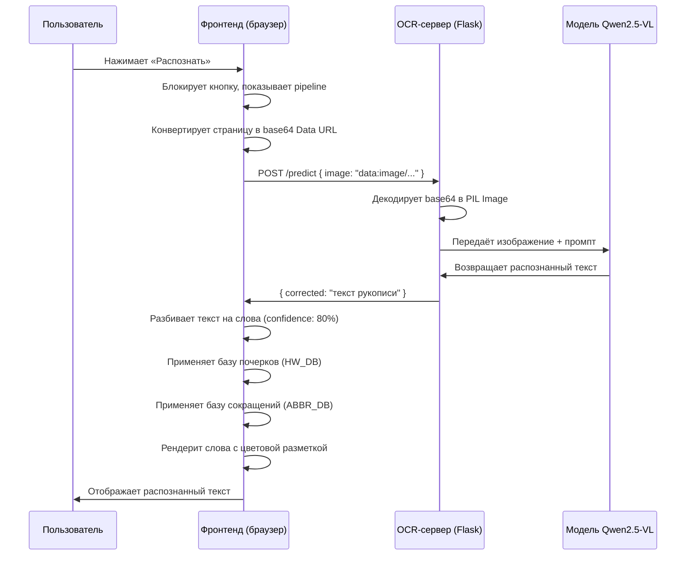
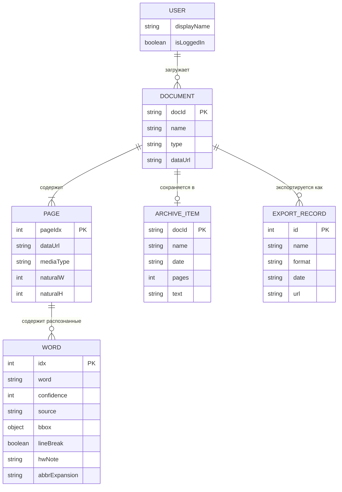
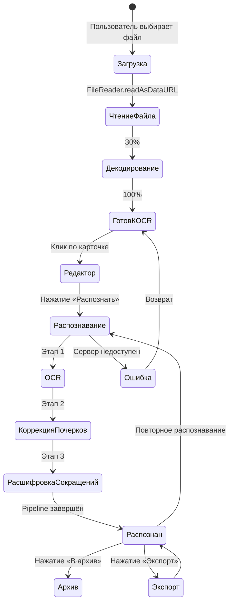
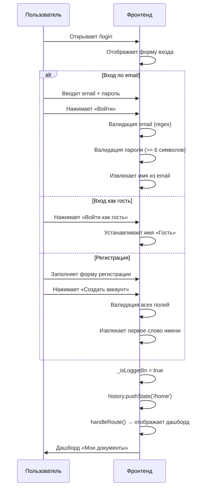

# SRS — Scriptorium: Расшифровка рукописных документов

---

## 0. Глоссарий

| Термин | Определение |
|---|---|
| **Система** | Веб-приложение «Scriptorium», предназначенное для автоматической расшифровки рукописных документов с помощью нейросетевой модели |
| **OCR** | Optical Character Recognition — оптическое распознавание символов; процесс преобразования изображения текста в машинно-читаемый текст |
| **Документ** | Загруженный пользователем файл изображения (JPG, PNG, TIFF) или многостраничный PDF, содержащий рукописный текст |
| **Страница** | Одно изображение внутри документа; для изображений документ содержит одну страницу, для PDF — по одной странице на каждый лист PDF-файла |
| **Слово** | Минимальная единица распознанного текста, характеризуемая текстовым значением, уровнем уверенности, источником распознавания и координатами на изображении |
| **Уровень уверенности** | Числовое значение от 0 до 100, выраженное в процентах, отражающее степень достоверности распознавания конкретного слова моделью |
| **Порог уверенности** | Настраиваемое пользователем пороговое значение уровня уверенности (от 0 до 100 %); слова с уровнем уверенности ниже порога визуально выделяются в редакторе как сомнительные |
| **Источник распознавания** | Метка, указывающая, каким этапом конвейера обработки было получено или скорректировано слово: OCR-модель, база почерков или база сокращений |
| **Конвейер обработки (pipeline)** | Последовательность из трёх этапов обработки документа: (1) OCR-распознавание нейросетевой моделью, (2) коррекция по базе почерков, (3) расшифровка сокращений |
| **База почерков** | Встроенный словарь типичных ошибок распознавания рукописных символов (например, «тго» → «его»), применяемый для коррекции результатов OCR-распознавания |
| **База сокращений** | Встроенный словарь устаревших и общеупотребительных сокращений (например, «губ.» → «губерния»), применяемый для расшифровки аббревиатур в распознанном тексте |
| **Архив** | Хранилище распознанных документов внутри текущей сессии браузера, позволяющее сохранять результаты распознавания для последующего экспорта |
| **Экспорт** | Процесс преобразования распознанного текста в файл одного из форматов (DOCX, PDF, TXT) и его скачивания пользователем |
| **Пакетная обработка** | Режим последовательного автоматического распознавания нескольких документов без ручного запуска OCR для каждого документа |
| **Viewport** | Область просмотра изображения документа в редакторе с поддержкой масштабирования, панорамирования и поворота |
| **Нейросетевая модель** | Qwen2.5-VL-3B-Instruct — мультимодальная модель машинного обучения, принимающая изображение и текстовый промпт, возвращающая распознанный текст |
| **OCR-сервер** | Flask-приложение, запускаемое в среде Google Colab, принимающее изображения по HTTP и возвращающее распознанный текст с помощью нейросетевой модели |
| **ngrok-туннель** | Сетевой туннель, предоставляющий публичный HTTPS-адрес для доступа к OCR-серверу, работающему в закрытой среде Google Colab |
| **Сессия** | Период работы пользователя с системой от момента входа до закрытия вкладки браузера; все данные (документы, архив, история экспорта) существуют только в рамках сессии |
| **Лендинг** | Публичная страница системы, доступная без авторизации, содержащая описание возможностей и кнопки входа/регистрации |
| **Дашборд** | Основной рабочий экран авторизованного пользователя, содержащий панели: «Мои документы», «Архив», «История экспорта», «Пакетная обработка» |
| **Редактор** | Экран системы, объединяющий viewport для просмотра изображения документа и панель распознанного текста с цветовой разметкой источников |
| **Гость** | Роль пользователя, вошедшего в систему без указания учётных данных через кнопку «Войти как гость» |
| **Пользователь** | Роль человека, взаимодействующего с системой через веб-интерфейс для загрузки документов, запуска распознавания, редактирования и экспорта результатов |
| **Администратор Colab** | Роль технического специалиста, запускающего и настраивающего OCR-сервер в среде Google Colab |
| **SPA** | Single Page Application — одностраничное веб-приложение, все экраны которого загружаются в одном HTML-документе и переключаются без перезагрузки страницы |

---

## 1. Введение

### 1.1 Назначение документа

Документ описывает требования к веб-приложению «Scriptorium» версии 1.0. Документ предназначен для разработчиков, тестировщиков и заинтересованных лиц проекта «Цифровая кафедра». Документ составлен на основе анализа исходного кода, конфигурационных файлов и документации проекта.

### 1.2 Описание системы и объект автоматизации

**Что это за система:**
Scriptorium — веб-приложение для автоматической расшифровки рукописных текстов. Система автоматизирует процесс перевода рукописных документов (писем, дневников, архивных материалов) в машинно-читаемый цифровой текст.

**Объект автоматизации:**
Процесс расшифровки рукописных документов, включающий: загрузку сканов, распознавание текста нейросетевой моделью, постобработку результатов (коррекция по базе почерков, расшифровка сокращений), редактирование и экспорт итогового текста.

**Бизнес-цель:**
Сокращение трудозатрат историков, архивистов и исследователей при работе с рукописными документами за счёт автоматизации первичной расшифровки текста.

### 1.3 Роли пользователей

| Роль | Описание | Доступ |
|---|---|---|
| **Пользователь** | Историк, архивист или исследователь, работающий с рукописными документами. Загружает сканы, запускает распознавание, редактирует и экспортирует результаты. | Все экраны системы после авторизации: дашборд, редактор, профиль, архив |
| **Гость** | Пользователь, вошедший без регистрации через кнопку «Войти как гость». Обладает теми же функциональными возможностями, что и зарегистрированный пользователь. | Идентичен роли «Пользователь» |
| **Администратор Colab** | Технический специалист, запускающий OCR-сервер в среде Google Colab, управляющий ngrok-токеном и обновлениями серверного кода. Не взаимодействует с веб-интерфейсом как конечный пользователь. | Google Colab, настройка SPACE_URL |

### 1.4 Границы системы

**Что входит в систему:**

- Публичный лендинг с описанием возможностей
- Авторизация (демо-режим: email/пароль, гостевой вход)
- Загрузка изображений (JPG, PNG, TIFF) и многостраничных PDF
- OCR-распознавание рукописного текста через нейросетевую модель Qwen2.5-VL-3B
- Постобработка результатов: коррекция по базе почерков и расшифровка сокращений
- Редактор с viewport (масштабирование, панорамирование, поворот, яркость, контраст)
- Выделение произвольной области изображения для распознавания
- Цветовая разметка слов по источнику распознавания
- Настройка порога уверенности
- Архив распознанных документов (в рамках сессии)
- Экспорт в форматы DOCX, PDF, TXT
- Пакетная обработка нескольких документов
- Навигация по страницам многостраничных документов
- URL-маршрутизация (History API)
- Профиль пользователя со статистикой сессии

**Что НЕ входит в систему (за границами scope):**

- `[ЗА ГРАНИЦАМИ]` Серверная база данных и персистентное хранение данных между сессиями
- `[ЗА ГРАНИЦАМИ]` Реальная аутентификация с проверкой учётных данных на сервере
- `[ЗА ГРАНИЦАМИ]` Многопользовательский доступ и разграничение прав
- `[ЗА ГРАНИЦАМИ]` Совместная работа над документами
- `[ЗА ГРАНИЦАМИ]` Обучение или дообучение модели на пользовательских данных
- `[ЗА ГРАНИЦАМИ]` Административная панель управления
- `[ЗА ГРАНИЦАМИ]` Интеграция с внешними архивными системами
- `[ЗА ГРАНИЦАМИ]` Мобильное приложение (присутствует только адаптивная веб-версия)

### 1.5 Стек и зависимости

| Компонент | Технология | Версия / источник |
|---|---|---|
| Фронтенд | HTML5, CSS3, Vanilla JavaScript (без фреймворков) | — |
| Хостинг фронтенда | GitHub Pages | — |
| PDF-рендеринг | PDF.js (CDN) | 3.11.174 |
| Шрифты | Inter, JetBrains Mono (Google Fonts CDN) | — |
| OCR-модель | Qwen2.5-VL-3B-Instruct (HuggingFace) | Qwen/Qwen2.5-VL-3B-Instruct |
| Серверный фреймворк | Flask + Flask-CORS | — |
| ML-фреймворк | PyTorch, Transformers (HuggingFace) | — |
| Обработка изображений | Pillow (PIL) | — |
| Сетевой туннель | pyngrok (ngrok) | — |
| Вспомогательные библиотеки | qwen-vl-utils, accelerate | — |
| Вычислительная среда | Google Colab (GPU NVIDIA T4) | — |

---

## 2. Бизнес-требования

| ID | Бизнес-требование | Приоритет |
|---|---|---|
| **BR-001** | Система должна позволять переводить рукописные документы в цифровой текст с минимальным участием пользователя. | Must |
| **BR-002** | Система должна снижать время расшифровки одного рукописного документа по сравнению с полностью ручной расшифровкой. | Must |
| **BR-003** | Система должна обеспечивать доступ к функциям распознавания через веб-браузер без установки программного обеспечения на компьютер пользователя. | Must |
| **BR-004** | Система должна предоставлять результат распознавания в редактируемых форматах (DOCX, PDF, TXT) для дальнейшей работы исследователя. | Must |
| **BR-005** | Система должна работать без затрат на выделенный сервер, используя бесплатные вычислительные ресурсы Google Colab. | Should |
| **BR-006** | Система должна поддерживать работу с многостраничными PDF-документами для обработки архивных материалов большого объёма. | Should |

---

## 3. Пользовательские требования (User Stories)

### Роль: Пользователь

| ID | User Story | Приоритет (MoSCoW) | INVEST |
|---|---|---|---|
| **US-001** | Как пользователь, я хочу загрузить скан рукописного документа, чтобы получить его цифровую расшифровку. | Must | I, N, V, E, S, T |
| **US-002** | Как пользователь, я хочу запустить распознавание загруженного документа одним нажатием, чтобы получить текст без сложной настройки. | Must | I, N, V, E, S, T |
| **US-003** | Как пользователь, я хочу видеть распознанный текст рядом с оригиналом документа, чтобы проверить корректность распознавания. | Must | I, N, V, E, S, T |
| **US-004** | Как пользователь, я хочу экспортировать распознанный текст в формат DOCX, чтобы продолжить работу в текстовом редакторе. | Must | I, N, V, E, S, T |
| **US-005** | Как пользователь, я хочу экспортировать распознанный текст в формат PDF, чтобы создать архивную копию для печати. | Must | I, N, V, E, S, T |
| **US-006** | Как пользователь, я хочу экспортировать распознанный текст в формат TXT, чтобы получить чистый текст без форматирования. | Must | I, N, V, E, S, T |
| **US-007** | Как пользователь, я хочу загружать многостраничные PDF-документы, чтобы обрабатывать архивные дела целиком. | Must | I, N, V, E, S, T |
| **US-008** | Как пользователь, я хочу переключаться между страницами документа, чтобы распознавать и просматривать каждую страницу отдельно. | Must | I, N, V, E, S, T |
| **US-009** | Как пользователь, я хочу распознать все страницы документа одной командой, чтобы не запускать распознавание для каждой страницы вручную. | Should | I, N, V, E, S, T |
| **US-010** | Как пользователь, я хочу масштабировать и поворачивать изображение документа, чтобы рассмотреть неразборчивые фрагменты. | Should | I, N, V, E, S, T |
| **US-011** | Как пользователь, я хочу регулировать яркость и контраст изображения, чтобы улучшить читаемость выцветших документов. | Should | I, N, V, E, S, T |
| **US-012** | Как пользователь, я хочу выделить произвольную область изображения и распознать только её, чтобы обработать конкретный фрагмент рукописи. | Should | I, N, V, E, S, T |
| **US-013** | Как пользователь, я хочу видеть цветовую маркировку слов по источнику (OCR, база почерков, сокращение), чтобы понимать, какие слова были скорректированы автоматически. | Should | I, N, V, E, S, T |
| **US-014** | Как пользователь, я хочу настраивать порог уверенности, чтобы видеть слова, распознанные с низкой достоверностью. | Should | I, N, V, E, S, T |
| **US-015** | Как пользователь, я хочу сохранять распознанные документы в архив, чтобы вернуться к ним позже в рамках текущей сессии. | Should | I, N, V, E, S, T |
| **US-016** | Как пользователь, я хочу запустить пакетную обработку нескольких документов, чтобы распознать их автоматически без ручного запуска для каждого. | Should | I, N, V, E, S, T |
| **US-017** | Как пользователь, я хочу войти в систему как гость без регистрации, чтобы быстро попробовать функциональность. | Could | I, N, V, E, S, T |
| **US-018** | Как пользователь, я хочу скопировать распознанный текст в буфер обмена, чтобы вставить его в другое приложение. | Could | I, N, V, E, S, T |
| **US-019** | Как пользователь, я хочу перетаскивать файлы в область загрузки (drag & drop), чтобы загружать документы без выбора через диалог файлов. | Could | I, N, V, E, S, T |
| **US-020** | Как пользователь, я хочу видеть статистику по распознанным документам в профиле, чтобы оценить объём выполненной работы. | Could | I, N, V, E, S, T |

### Роль: Администратор Colab

| ID | User Story | Приоритет (MoSCoW) | INVEST |
|---|---|---|---|
| **US-021** | Как администратор Colab, я хочу запустить OCR-сервер последовательным выполнением ячеек ноутбука, чтобы сделать модель доступной для фронтенда. | Must | I, N, V, E, S, T |
| **US-022** | Как администратор Colab, я хочу обновить серверный код перезапуском одной ячейки (без перезагрузки модели), чтобы минимизировать время деплоя. | Should | I, N, V, E, S, T |

---

## 4. Функциональные требования

---

### FR-001 — Отображение публичного лендинга

| Поле | Значение |
|---|---|
| ID | FR-001 |
| Приоритет | Must |
| Роль | Пользователь (неавторизованный) |
| Триггер | Пользователь открывает корневой URL системы (`/`) |

**User Story:**
> Как пользователь, я хочу увидеть описание системы на главной странице, чтобы понять назначение и возможности сервиса.

**Use Case (основной сценарий):**
1. Пользователь открывает URL `/` в браузере.
2. Система отображает экран лендинга, содержащий: заголовок «Расшифровка рукописей с помощью ИИ», описание возможностей, секцию «Инструменты» с 6 карточками (Распознавание, Пакетная обработка, Экспорт в Word, База сокращений, База почерков, Архив), кнопки «Войти» и «Регистрация».
3. Система отображает навигационные ссылки «Возможности» и «Инструменты» в верхней панели.

**Альтернативные сценарии / ошибки:**
- Пользователь нажимает на карточку инструмента → Система перенаправляет на экран авторизации.

**Входные данные:** URL-путь `/`
**Выходные данные / результат:** Отрисованный экран лендинга `#screen-landing`
**Трассировка:** [index.html:22-87](index.html#L22-L87) (разметка лендинга), [router.js:8](js/router.js#L8) (маршрут `/`), [auth.js:6](js/auth.js#L6) (SCREEN_PATHS)

---

### FR-002 — Вход в систему по email и паролю

| Поле | Значение |
|---|---|
| ID | FR-002 |
| Приоритет | Must |
| Роль | Пользователь |
| Триггер | Пользователь нажимает кнопку «Войти в систему» на форме входа |

**User Story:**
> Как пользователь, я хочу войти в систему, указав email и пароль, чтобы получить доступ к функциям распознавания.

**Use Case (основной сценарий):**
1. Пользователь вводит email в поле «Электронная почта».
2. Пользователь вводит пароль в поле «Пароль».
3. Пользователь нажимает кнопку «Войти в систему».
4. Система валидирует формат email (регулярное выражение `^[^\s@]+@[^\s@]+\.[^\s@]+$`).
5. Система проверяет, что длина пароля составляет не менее 6 символов.
6. Система извлекает имя пользователя из части email до символа `@`.
7. Система устанавливает флаг `_isLoggedIn = true`.
8. Система перенаправляет пользователя на дашборд (`/home`).

**Альтернативные сценарии / ошибки:**
- Email не соответствует формату → Система отображает сообщение «Введите корректный email» под полем email.
- Пароль короче 6 символов → Система отображает сообщение «Минимум 6 символов» под полем пароля.

**Входные данные:**
| Поле | Тип | Валидация |
|---|---|---|
| email | string | Соответствие регулярному выражению `^[^\s@]+@[^\s@]+\.[^\s@]+$` |
| password | string | Длина >= 6 символов |

**Выходные данные / результат:** Переход на экран дашборда, установка `_isLoggedIn = true`, отображение имени пользователя в аватаре навигации.

`[ПРЕДПОЛОЖЕНИЕ]` Авторизация работает в демо-режиме: любая комбинация корректного email и пароля достаточной длины принимается без проверки на сервере.

**Трассировка:** [auth.js:64-79](js/auth.js#L64-L79) (`submitLogin`), [auth.js:106-119](js/auth.js#L106-L119) (`finishLogin`), [index.html:102-119](index.html#L102-L119) (форма входа)

---

### FR-003 — Регистрация нового пользователя

| Поле | Значение |
|---|---|
| ID | FR-003 |
| Приоритет | Must |
| Роль | Пользователь |
| Триггер | Пользователь нажимает кнопку «Создать аккаунт» на форме регистрации |

**User Story:**
> Как пользователь, я хочу зарегистрироваться в системе, чтобы получить персонализированный доступ.

**Use Case (основной сценарий):**
1. Пользователь вводит имя и фамилию.
2. Пользователь вводит email.
3. Пользователь вводит пароль.
4. Пользователь вводит подтверждение пароля.
5. Пользователь нажимает «Создать аккаунт».
6. Система валидирует: имя >= 2 символов, email по формату, пароль >= 8 символов, пароли совпадают.
7. Система извлекает первое слово из имени как отображаемое имя.
8. Система выполняет вход и перенаправляет на дашборд.

**Альтернативные сценарии / ошибки:**
- Имя короче 2 символов → Система отображает «Введите имя (мин. 2 символа)».
- Email некорректен → Система отображает «Некорректный email».
- Пароль короче 8 символов → Система отображает «Минимум 8 символов».
- Пароли не совпадают → Система отображает «Пароли не совпадают».

**Входные данные:**
| Поле | Тип | Валидация |
|---|---|---|
| name | string | Длина >= 2 символов |
| email | string | Соответствие регулярному выражению `^[^\s@]+@[^\s@]+\.[^\s@]+$` |
| password | string | Длина >= 8 символов |
| password2 | string | Должен совпадать с полем password |

**Выходные данные / результат:** Переход на дашборд, установка `_isLoggedIn = true`.

`[ПРЕДПОЛОЖЕНИЕ]` Данные регистрации не сохраняются на сервере; регистрация функционально эквивалентна входу.

**Трассировка:** [auth.js:83-98](js/auth.js#L83-L98) (`submitRegister`), [index.html:121-144](index.html#L121-L144) (форма регистрации)

---

### FR-004 — Вход как гость

| Поле | Значение |
|---|---|
| ID | FR-004 |
| Приоритет | Should |
| Роль | Пользователь |
| Триггер | Пользователь нажимает кнопку «Войти как гость» |

**User Story:**
> Как пользователь, я хочу войти в систему без ввода учётных данных, чтобы быстро оценить функциональность.

**Use Case (основной сценарий):**
1. Пользователь нажимает кнопку «Войти как гость».
2. Система устанавливает отображаемое имя «Гость».
3. Система выполняет вход и перенаправляет на дашборд.

**Входные данные:** Нажатие кнопки (без полей ввода).
**Выходные данные / результат:** Переход на дашборд, имя пользователя «Гость».
**Трассировка:** [auth.js:101-103](js/auth.js#L101-L103) (`loginAsGuest`), [index.html:103-106](index.html#L103-L106) (кнопка гостевого входа)

---

### FR-005 — Загрузка файла документа

| Поле | Значение |
|---|---|
| ID | FR-005 |
| Приоритет | Must |
| Роль | Пользователь |
| Триггер | Пользователь выбирает файл через диалог или перетаскивает файл в область загрузки |

**User Story:**
> Как пользователь, я хочу загрузить скан рукописного документа, чтобы система могла его распознать.

**Use Case (основной сценарий):**
1. Пользователь нажимает кнопку «+ Загрузить» или «Выбрать файл», либо перетаскивает файл в область загрузки.
2. Система проверяет MIME-тип файла (допустимые: `image/jpeg`, `image/png`, `application/pdf`, `image/tiff`).
3. Система проверяет, что размер файла не превышает 50 МБ.
4. Система создаёт карточку документа в секции «Последние документы» с превью (для изображений) или иконкой PDF.
5. Система отображает прогресс-бар с этапами: «Читаю файл…» (30 %), «Декодирование…» (65 %), «Готово к OCR» (100 %).
6. Система присваивает документу уникальный идентификатор формата `doc-{timestamp}{random}`.
7. Система конвертирует файл в формат Data URL (base64).
8. Система обновляет статистику документов на дашборде.

**Альтернативные сценарии / ошибки:**
- MIME-тип файла не входит в список допустимых → Система отображает toast «Формат не поддерживается: {имя файла}».
- Размер файла превышает 50 МБ → Система отображает toast «Файл слишком большой: {имя файла}».

**Входные данные:**
| Поле | Тип | Валидация |
|---|---|---|
| file | File | MIME-тип из набора {image/jpeg, image/png, application/pdf, image/tiff}; размер <= 52 428 800 байт (50 МБ) |

**Выходные данные / результат:** Карточка документа на дашборде со статусом «Готово к OCR», документ в хранилище `uploadedDocs`.
**Трассировка:** [dashboard.js:64-142](js/dashboard.js#L64-L142) (`processFiles`, `addFileCard`, `animateCard`), [index.html:179-181](index.html#L179-L181) (input file)

---

### FR-006 — Загрузка файла перетаскиванием (drag & drop)

| Поле | Значение |
|---|---|
| ID | FR-006 |
| Приоритет | Could |
| Роль | Пользователь |
| Триггер | Пользователь перетаскивает файл в область загрузки на дашборде |

**User Story:**
> Как пользователь, я хочу перетаскивать файлы в зону загрузки, чтобы загружать документы без диалога выбора файлов.

**Use Case (основной сценарий):**
1. Пользователь начинает перетаскивание файла над областью загрузки.
2. Система добавляет визуальный стиль `drag-over` к области загрузки и отображает текст «Отпустите для загрузки».
3. Пользователь отпускает файл.
4. Система обрабатывает файл аналогично FR-005.

**Альтернативные сценарии / ошибки:**
- Пользователь уводит файл за пределы области → Система снимает визуальный стиль `drag-over`.
- Перетаскивание вне дашборда → Система игнорирует событие.

**Входные данные:** Файл (объект `DataTransfer`).
**Выходные данные / результат:** Аналогично FR-005.
**Трассировка:** [dashboard.js:144-178](js/dashboard.js#L144-L178) (`initDnD`)

---

### FR-007 — Открытие документа в редакторе

| Поле | Значение |
|---|---|
| ID | FR-007 |
| Приоритет | Must |
| Роль | Пользователь |
| Триггер | Пользователь нажимает на карточку документа на дашборде |

**User Story:**
> Как пользователь, я хочу открыть загруженный документ в редакторе, чтобы просмотреть изображение и запустить распознавание.

**Use Case (основной сценарий):**
1. Пользователь нажимает на карточку документа со статусом «Готово к OCR».
2. Система переключает экран на редактор (`/ocr`).
3. Система инициализирует viewport (обработчики событий мыши, колеса, тач-жестов).
4. Для PDF: система извлекает все страницы с помощью PDF.js (рендеринг с масштабом 2.0), создаёт миниатюры.
5. Для изображений: система создаёт одну страницу из Data URL.
6. Система отображает первую страницу документа, подгоняя масштаб под размер viewport (коэффициент 0.92 от вписанного размера).
7. Система отображает имя документа в навигационной панели.

**Альтернативные сценарии / ошибки:**
- Ошибка парсинга PDF → Система отображает toast «Ошибка PDF: {сообщение}» и устанавливает пустой массив страниц.

**Входные данные:** Идентификатор документа (`docId`).
**Выходные данные / результат:** Экран редактора с изображением первой страницы.
**Трассировка:** [editor.js:17-28](js/editor.js#L17-L28) (`openEditor`), [editor.js:31-72](js/editor.js#L31-L72) (`initPages`, `extractPdfPages`)

---

### FR-008 — OCR-распознавание текущей страницы

| Поле | Значение |
|---|---|
| ID | FR-008 |
| Приоритет | Must |
| Роль | Пользователь |
| Триггер | Пользователь нажимает кнопку «Распознать» в панели инструментов редактора |

**User Story:**
> Как пользователь, я хочу запустить распознавание текущей страницы, чтобы получить цифровой текст рукописи.

**Use Case (основной сценарий):**
1. Пользователь нажимает кнопку «⚡ Распознать».
2. Система блокирует кнопку распознавания.
3. Система отображает индикатор конвейера (pipeline bar) с тремя этапами.
4. Система отображает состояние загрузки «OCR-распознавание…».
5. **Этап 1 — OCR:** Система отправляет POST-запрос на OCR-сервер (`{SPACE_URL}/predict`) с телом `{ image: "<base64 Data URL>" }`.
6. Система получает ответ `{ corrected: "<текст>" }` от сервера.
7. Система преобразует текст в массив объектов слов (разделение по пробелам и переносам строк, начальный уровень уверенности 80 %).
8. **Этап 2 — База почерков:** Если чекбокс «Почерки» включён, система применяет коррекцию по словарю `HW_DB` к словам с уровнем уверенности ниже 85 %.
9. **Этап 3 — Сокращения:** Если чекбокс «Сокращения» включён, система сопоставляет слова со словарём `ABBR_DB` и добавляет расшифровку.
10. Система сохраняет массив слов в `doc.pageWords[currentPage]`.
11. Система отображает распознанный текст с цветовой разметкой по источнику.
12. Система обновляет статистику и отмечает миниатюру страницы как обработанную.

**Альтернативные сценарии / ошибки:**
- Нет связи с OCR-сервером → Система отображает toast «Нет связи с сервером. Проверь SPACE_URL в js/api.js и убедись, что Colab запущен.»
- HTTP-ошибка от сервера → Система отображает toast «HTTP {код}: {тело ответа (до 200 символов)}».
- Модель вернула пустой текст → Система отображает toast «Модель не распознала текст».
- Поле `image` отсутствует в запросе → OCR-сервер возвращает HTTP 400 с телом `{ error: "Поле image отсутствует" }`.

**Входные данные:**
| Поле | Тип | Описание |
|---|---|---|
| image | string (base64 Data URL) | Изображение страницы документа в формате Data URL |

**Выходные данные / результат:** Массив объектов слов `[{ word, confidence, source, bbox, lineBreak }]`, отображённый в текстовой панели редактора.

**Трассировка:** [editor.js:440-460](js/editor.js#L440-L460) (`recognizeCurrentPage`), [editor.js:524-550](js/editor.js#L524-L550) (`runPipeline`), [api.js:10-32](js/api.js#L10-L32) (`runHuggingFaceOCR`), [api.js:37-50](js/api.js#L37-L50) (`callServer`), [server.py:20-66](colab/server.py#L20-L66) (`recognize`), [server.py:74-81](colab/server.py#L74-L81) (endpoint `/predict`)

---

### FR-009 — OCR-распознавание всех страниц документа

| Поле | Значение |
|---|---|
| ID | FR-009 |
| Приоритет | Should |
| Роль | Пользователь |
| Триггер | Пользователь нажимает кнопку «Весь документ» в панели инструментов редактора |

**User Story:**
> Как пользователь, я хочу распознать все страницы документа одной командой, чтобы не запускать распознавание для каждой страницы вручную.

**Use Case (основной сценарий):**
1. Пользователь нажимает кнопку «Весь документ».
2. Система блокирует кнопку.
3. Система отображает toast «Распознаю {N} страниц…».
4. Система последовательно для каждой страницы от 0 до N-1: переключает отображение на страницу, запускает конвейер обработки (FR-008, шаги 4–11), сохраняет результат.
5. Система отображает toast «Все страницы распознаны».
6. Система разблокирует кнопку и обновляет статистику.

**Альтернативные сценарии / ошибки:**
- Ошибка при обработке одной страницы → Система логирует предупреждение в консоль и продолжает обработку следующих страниц.

**Входные данные:** Идентификатор документа.
**Выходные данные / результат:** Массивы слов для каждой страницы документа.
**Трассировка:** [editor.js:462-482](js/editor.js#L462-L482) (`recognizeAllPages`)

---

### FR-010 — Распознавание выделенной области

| Поле | Значение |
|---|---|
| ID | FR-010 |
| Приоритет | Should |
| Роль | Пользователь |
| Триггер | Пользователь выделяет область на изображении в режиме выделения и нажимает кнопку «⚡» |

**User Story:**
> Как пользователь, я хочу выделить область на изображении и распознать только её, чтобы обработать конкретный фрагмент рукописи.

**Use Case (основной сценарий):**
1. Пользователь переключает viewport в режим выделения (кнопка «⬚»).
2. Пользователь рисует прямоугольную область на изображении мышью.
3. Система затемняет изображение за пределами выделения и отрисовывает пунктирную рамку цвета `#2563eb` с угловыми маркерами.
4. Система отображает кнопки «⚡» (распознать выделение) и «✕» (очистить).
5. Пользователь нажимает «⚡».
6. Система вырезает выделенную область из изображения страницы в формат JPEG (качество 0.95).
7. Система выполняет конвейер обработки (FR-008) для вырезанного изображения.
8. Система добавляет распознанные слова к существующим словам страницы (конкатенация).
9. Система отображает обновлённый текст и снимает выделение.

**Альтернативные сценарии / ошибки:**
- Выделенная область имеет размер менее 4x4 пикселей → Система отображает toast «Сначала выделите область».
- Ошибка распознавания → Система отображает toast с описанием ошибки и восстанавливает предыдущее состояние текстовой панели.

**Входные данные:** Координаты прямоугольной области `{ x, y, w, h }` в пикселях изображения.
**Выходные данные / результат:** Слова, добавленные к существующему массиву слов страницы.
**Трассировка:** [editor.js:484-521](js/editor.js#L484-L521) (`recognizeSelection`), [editor.js:345-369](js/editor.js#L345-L369) (`drawSelRect`, `clearSelection`)

---

### FR-011 — Коррекция по базе почерков

| Поле | Значение |
|---|---|
| ID | FR-011 |
| Приоритет | Should |
| Роль | Пользователь |
| Триггер | Конвейер обработки достигает этапа 2; чекбокс «Почерки» включён |

**User Story:**
> Как пользователь, я хочу, чтобы система автоматически исправляла типичные ошибки распознавания рукописных символов, чтобы повысить качество результата.

**Use Case (основной сценарий):**
1. Система получает массив слов после этапа OCR.
2. Для каждого слова система приводит текст к нижнему регистру и удаляет знаки пунктуации.
3. Система проверяет наличие слова в словаре `HW_DB`.
4. Если слово найдено и его уровень уверенности ниже 85 %: система заменяет слово на корректный вариант, устанавливает источник `hwdb`, увеличивает уровень уверенности на 20 (максимум 90 %).

**Входные данные:** Массив объектов слов.
**Выходные данные / результат:** Массив объектов слов с примененными коррекциями.

Текущий состав словаря `HW_DB` (8 записей):
| Ключ | Замена | Описание |
|---|---|---|
| тго | его | Ошибочное распознавание «е» как «т» |
| nо | по | Латинская «n» вместо кириллической «п» |
| nри | при | Латинская «n» вместо кириллической «п» |
| вь | въ | «ь» вместо «ъ» |
| вб | въ | «б» вместо «ъ» |
| l | і | Латинская «l» вместо кириллической «і» |
| г-нь | господинъ | Сокращённое обращение |
| г-жа | госпожа | Сокращённое обращение |

**Трассировка:** [editor.js:553-573](js/editor.js#L553-L573) (`HW_DB`, `applyHandwritingDB`)

---

### FR-012 — Расшифровка сокращений

| Поле | Значение |
|---|---|
| ID | FR-012 |
| Приоритет | Should |
| Роль | Пользователь |
| Триггер | Конвейер обработки достигает этапа 3; чекбокс «Сокращения» включён |

**User Story:**
> Как пользователь, я хочу, чтобы система автоматически расшифровывала устаревшие сокращения в тексте, чтобы повысить читаемость результата.

**Use Case (основной сценарий):**
1. Система получает массив слов после этапа коррекции почерков.
2. Для каждого слова система приводит текст к нижнему регистру.
3. Система проверяет наличие слова в словаре `ABBR_DB` (прямое совпадение или совпадение после добавления точки).
4. Если сокращение найдено: система устанавливает источник `abbr`, сохраняет расшифровку в поле `abbrExpansion`, устанавливает уровень уверенности не ниже 88 %.

**Входные данные:** Массив объектов слов.
**Выходные данные / результат:** Массив объектов слов с расшифрованными сокращениями.

Текущий состав словаря `ABBR_DB` содержит 30 записей, включая: общеупотребительные сокращения (г., гг., т.е., т.к.), титулы (проф., акад., д-р, тов.), архивные обозначения (ф., оп., д., л., лл., об.), географические (губ., у., вол.), месяцы (янв.–дек.) и другие.

**Трассировка:** [editor.js:576-599](js/editor.js#L576-L599) (`ABBR_DB`, `applyAbbreviations`)

---

### FR-013 — Отображение распознанного текста с цветовой разметкой

| Поле | Значение |
|---|---|
| ID | FR-013 |
| Приоритет | Must |
| Роль | Пользователь |
| Триггер | Завершение конвейера обработки (FR-008) |

**User Story:**
> Как пользователь, я хочу видеть распознанный текст с цветовой маркировкой по источнику, чтобы понимать происхождение каждого слова.

**Use Case (основной сценарий):**
1. Система получает массив слов после полного конвейера обработки.
2. Система создаёт HTML-элемент `<span class="tw">` для каждого слова.
3. Система присваивает CSS-класс в зависимости от источника: `tw-ocr`, `tw-hwdb`, `tw-abbr`, `tw-uncertain`.
4. Система применяет классы `conf-low` или `conf-vlow` к словам с уровнем уверенности ниже порога.
5. Система добавляет атрибут `data-tip` с информацией: источник, уровень уверенности, примечание базы почерков, расшифровку сокращения.
6. Система группирует слова в абзацы `<p>` по признаку `lineBreak`.
7. Система отображает статистику: количество слов по источникам.

**Входные данные:** Массив объектов слов.
**Выходные данные / результат:** HTML-разметка распознанного текста в панели `#textContent`.

Цветовая схема:
| Источник | CSS-класс | Описание |
|---|---|---|
| OCR | `tw-ocr` | Результат нейросетевой модели без коррекций |
| База почерков | `tw-hwdb` | Слово скорректировано по базе почерков |
| Сокращение | `tw-abbr` | Слово является известным сокращением |
| Не распознано | `tw-uncertain` | Слово с низким уровнем уверенности |

**Трассировка:** [editor.js:602-655](js/editor.js#L602-L655) (`renderWords`, `srcLabel`)

---

### FR-014 — Настройка порога уверенности

| Поле | Значение |
|---|---|
| ID | FR-014 |
| Приоритет | Should |
| Роль | Пользователь |
| Триггер | Пользователь перемещает ползунок «Порог» в панели инструментов редактора |

**User Story:**
> Как пользователь, я хочу настраивать порог уверенности, чтобы визуально выделять слова, распознанные с низкой достоверностью.

**Use Case (основной сценарий):**
1. Пользователь перемещает ползунок (диапазон 0–100 %, значение по умолчанию 60 %).
2. Система обновляет отображаемое значение порога.
3. Система пересчитывает классы CSS для каждого слова: если уровень уверенности слова < порога, система добавляет класс `conf-low`; если уровень уверенности < порога * 0.65, система добавляет класс `conf-vlow`.

**Входные данные:** Значение порога (целое число от 0 до 100).
**Выходные данные / результат:** Визуальное обновление стилей слов в текстовой панели.
**Трассировка:** [editor.js:678-687](js/editor.js#L678-L687) (`updateConfidence`), [index.html:284-288](index.html#L284-L288) (ползунок)

---

### FR-015 — Навигация по страницам документа

| Поле | Значение |
|---|---|
| ID | FR-015 |
| Приоритет | Must |
| Роль | Пользователь |
| Триггер | Пользователь нажимает кнопку навигации, миниатюру страницы или вводит номер страницы |

**User Story:**
> Как пользователь, я хочу переключаться между страницами документа, чтобы просматривать и распознавать каждую страницу.

**Use Case (основной сценарий):**
1. Пользователь нажимает кнопку «▶» (следующая), «◀» (предыдущая), «⏮» (первая), «⏭» (последняя), миниатюру страницы или вводит номер в поле ввода.
2. Система проверяет, что индекс страницы находится в допустимом диапазоне (от 0 до N-1).
3. Система загружает изображение новой страницы и подгоняет масштаб viewport.
4. Система подсвечивает активную миниатюру.
5. Система обновляет счётчик страниц.
6. Если для страницы есть распознанный текст — система отображает его; иначе — отображает состояние «Текст ещё не распознан».

**Входные данные:** Индекс страницы (целое число).
**Выходные данные / результат:** Отображение выбранной страницы в viewport.
**Трассировка:** [editor.js:143-204](js/editor.js#L143-L204) (`buildPageThumbs`, `setPageCounter`, `goToPage`, `goToLastPage`, `goToPageFromInput`), [editor.js:98-141](js/editor.js#L98-L141) (`showPage`)

---

### FR-016 — Управление viewport (масштаб, панорамирование, поворот)

| Поле | Значение |
|---|---|
| ID | FR-016 |
| Приоритет | Should |
| Роль | Пользователь |
| Триггер | Пользователь взаимодействует с viewport (колесо мыши, перетаскивание, кнопки, тач-жесты) |

**User Story:**
> Как пользователь, я хочу масштабировать, перемещать и поворачивать изображение документа, чтобы детально рассмотреть фрагменты рукописи.

**Use Case (основной сценарий):**
1. **Масштабирование колесом:** коэффициент 1.12 (увеличение) или 0.88 (уменьшение) за один шаг, масштаб от центра курсора.
2. **Масштабирование кнопками:** шаг ±0.2 при нажатии «+» / «−».
3. **Подгонка по размеру:** кнопка «⊡» вписывает изображение в viewport с коэффициентом 0.92.
4. **Панорамирование:** перетаскивание мышью в режиме `pan`.
5. **Поворот:** кнопки «↺» / «↻» поворачивают на ±90°.
6. **Тач-жесты:** один палец — панорамирование, два пальца — масштабирование (pinch-to-zoom).
7. Система обновляет CSS-трансформацию `translate + rotate + scale` для элемента `#imgStage`.
8. Система отображает текущий масштаб в процентах.

**Ограничения:**
- Минимальный масштаб: 0.1 (10 %)
- Максимальный масштаб: 8.0 (800 %)

**Входные данные:** События мыши, колеса, тач-жесты.
**Выходные данные / результат:** Обновлённое положение и масштаб изображения в viewport.
**Трассировка:** [editor.js:211-331](js/editor.js#L211-L331) (`applyVpTransform`, `vpFit`, `vZoom`, `vRotate`, `onVpWheel`, `onVpMouseDown/Move/Up`, `onVpTouchStart/Move/End`)

---

### FR-017 — Регулировка яркости и контраста

| Поле | Значение |
|---|---|
| ID | FR-017 |
| Приоритет | Should |
| Роль | Пользователь |
| Триггер | Пользователь перемещает ползунки яркости или контраста |

**User Story:**
> Как пользователь, я хочу регулировать яркость и контраст изображения, чтобы улучшить читаемость выцветших документов.

**Use Case (основной сценарий):**
1. Пользователь перемещает ползунок яркости (диапазон 40–200 %, по умолчанию 100 %) или контраста (диапазон 40–250 %, по умолчанию 100 %).
2. Система применяет CSS-фильтр `brightness({value}%) contrast({value}%)` к элементу изображения.
3. Система обновляет числовое отображение текущих значений.

**Входные данные:** Значения яркости (40–200) и контраста (40–250) в процентах.
**Выходные данные / результат:** Визуальное изменение изображения документа в viewport.
**Трассировка:** [editor.js:391-407](js/editor.js#L391-L407) (`applyImgFilter`, `updateSliderLabel`), [index.html:356-372](index.html#L356-L372) (ползунки)

---

### FR-018 — Сохранение в архив

| Поле | Значение |
|---|---|
| ID | FR-018 |
| Приоритет | Should |
| Роль | Пользователь |
| Триггер | Пользователь нажимает кнопку «В архив» в панели инструментов редактора |

**User Story:**
> Как пользователь, я хочу сохранить распознанный документ в архив, чтобы вернуться к нему позже в текущей сессии.

**Use Case (основной сценарий):**
1. Пользователь нажимает «🗃️ В архив».
2. Система проверяет наличие открытого документа и распознанных страниц.
3. Система формирует полный текст из всех распознанных страниц (разделитель: `\n\n--- Страница ---\n\n`).
4. Система создаёт запись архива: `{ docId, name, date, pages, text, pageWords }`.
5. Если документ уже был в архиве — система обновляет запись; иначе — добавляет в начало списка.
6. Система отображает toast «Сохранено в архив: {имя}» или «Архив обновлён: {имя}».
7. Система обновляет статистику.

**Альтернативные сценарии / ошибки:**
- Нет открытого документа → Система отображает toast «Нет открытого документа».
- Документ не распознан → Система отображает toast «Сначала распознайте документ».

**Входные данные:** Текущий документ с результатами распознавания.
**Выходные данные / результат:** Запись в массиве `archiveItems`.
**Трассировка:** [dashboard.js:181-198](js/dashboard.js#L181-L198) (`saveToArchive`)

---

### FR-019 — Просмотр и управление архивом

| Поле | Значение |
|---|---|
| ID | FR-019 |
| Приоритет | Should |
| Роль | Пользователь |
| Триггер | Пользователь переходит на панель «Архив» на дашборде |

**User Story:**
> Как пользователь, я хочу просматривать архив распознанных документов, чтобы скачать или удалить результаты.

**Use Case (основной сценарий):**
1. Пользователь нажимает «Архив» в боковой панели дашборда.
2. Система отображает список архивных записей, каждая содержит: имя документа, количество страниц, дату сохранения.
3. Для каждой записи доступны: кнопка «↓ TXT» (скачать TXT) и кнопка «✕» (удалить).

**Альтернативные сценарии / ошибки:**
- Архив пуст → Система отображает заглушку «Архив пуст» с инструкцией.

**Входные данные:** Нет.
**Выходные данные / результат:** Список архивных записей или заглушка.
**Трассировка:** [dashboard.js:200-237](js/dashboard.js#L200-L237) (`renderArchive`, `archiveDownloadTxt`, `archiveDelete`)

---

### FR-020 — Экспорт всех документов из архива

| Поле | Значение |
|---|---|
| ID | FR-020 |
| Приоритет | Could |
| Роль | Пользователь |
| Триггер | Пользователь нажимает кнопку «Экспортировать все» на панели архива |

**User Story:**
> Как пользователь, я хочу скачать все документы из архива одним действием, чтобы получить все результаты сразу.

**Use Case (основной сценарий):**
1. Пользователь нажимает «📤 Экспортировать все».
2. Система последовательно скачивает каждый документ архива в формате TXT.

**Альтернативные сценарии / ошибки:**
- Архив пуст → Система отображает toast «Архив пуст».

**Входные данные:** Нет.
**Выходные данные / результат:** Скачанные TXT-файлы для каждого документа в архиве.
**Трассировка:** [dashboard.js:239-242](js/dashboard.js#L239-L242) (`archiveExportAll`)

---

### FR-021 — Экспорт в формат TXT

| Поле | Значение |
|---|---|
| ID | FR-021 |
| Приоритет | Must |
| Роль | Пользователь |
| Триггер | Пользователь выбирает «Текст (.txt)» в модальном окне экспорта |

**User Story:**
> Как пользователь, я хочу экспортировать результат в TXT, чтобы получить чистый текст.

**Use Case (основной сценарий):**
1. Пользователь нажимает «📤 Экспорт» → выбирает «Текст (.txt)».
2. Система извлекает текстовое содержимое всех элементов `.tw` из текстовой панели.
3. Система группирует слова по абзацам.
4. Система создаёт Blob с типом `text/plain;charset=utf-8`.
5. Система инициирует скачивание файла `{имя документа}_распознано.txt`.
6. Система добавляет запись в историю экспорта.

**Альтернативные сценарии / ошибки:**
- Нет распознанного текста → Система отображает toast «Нет текста».

**Входные данные:** Распознанный текст из DOM-элементов `.tw`.
**Выходные данные / результат:** Файл `.txt` в кодировке UTF-8.
**Трассировка:** [dashboard.js:384-403](js/dashboard.js#L384-L403) (`exportTxt`)

---

### FR-022 — Экспорт в формат DOCX

| Поле | Значение |
|---|---|
| ID | FR-022 |
| Приоритет | Must |
| Роль | Пользователь |
| Триггер | Пользователь выбирает «Microsoft Word (.docx)» в модальном окне экспорта |

**User Story:**
> Как пользователь, я хочу экспортировать результат в DOCX, чтобы продолжить работу в текстовом редакторе.

**Use Case (основной сценарий):**
1. Пользователь нажимает «📤 Экспорт» → выбирает «Microsoft Word (.docx)».
2. Система извлекает слова из DOM с атрибутами источника и уровня уверенности.
3. Система формирует XML-документ WordprocessingML: шрифт Times New Roman, размер 12pt, межстрочный интервал 1.5, выравнивание по ширине, поля: верх/низ 2 см, лево 3 см, право 1.5 см.
4. Система применяет цветовое кодирование текста: `#C0392B` (не распознано / уверенность < 40 %), `#1565C0` (база почерков), `#6A1B9A` (сокращение).
5. Система собирает ZIP-архив из XML-файлов (document.xml, styles.xml, .rels, Content_Types.xml) с расчётом CRC32.
6. Система инициирует скачивание файла `{имя}_распознано.docx`.

**Альтернативные сценарии / ошибки:**
- Нет распознанного текста → Система отображает toast «Нет текста».

**Входные данные:** Распознанный текст с метаданными из DOM.
**Выходные данные / результат:** Файл `.docx` (Office Open XML).
**Трассировка:** [dashboard.js:406-513](js/dashboard.js#L406-L513) (`exportDocx`, `buildDocxZip`)

---

### FR-023 — Экспорт в формат PDF

| Поле | Значение |
|---|---|
| ID | FR-023 |
| Приоритет | Must |
| Роль | Пользователь |
| Триггер | Пользователь выбирает «PDF» в модальном окне экспорта |

**User Story:**
> Как пользователь, я хочу экспортировать результат в PDF, чтобы создать документ для печати и архивирования.

**Use Case (основной сценарий):**
1. Пользователь нажимает «📤 Экспорт» → выбирает «PDF».
2. Система формирует HTML-документ с форматированием: Times New Roman 13pt, межстрочный интервал 1.8, поля 2.5 см × 3 см, формат A4.
3. Система применяет цветовое кодирование: `#c0392b` (не распознано), `#1565C0` (почерки), `#6A1B9A` (сокращения), `#111` (OCR по умолчанию).
4. Система открывает сформированный HTML в новой вкладке.
5. Система автоматически вызывает диалог печати браузера (`window.print()`).
6. Система отображает toast «Откроется диалог печати — выберите «Сохранить как PDF»».

**Альтернативные сценарии / ошибки:**
- Нет распознанного текста → Система отображает toast «Нет текста».

**Входные данные:** Распознанный текст с метаданными из DOM.
**Выходные данные / результат:** HTML-страница с диалогом печати для сохранения в PDF.
**Трассировка:** [dashboard.js:515-558](js/dashboard.js#L515-L558) (`exportPdf`)

---

### FR-024 — Пакетная обработка документов

| Поле | Значение |
|---|---|
| ID | FR-024 |
| Приоритет | Should |
| Роль | Пользователь |
| Триггер | Пользователь нажимает «Запустить все» на панели пакетной обработки |

**User Story:**
> Как пользователь, я хочу запустить распознавание нескольких документов одной командой, чтобы обработать пакет сканов автоматически.

**Use Case (основной сценарий):**
1. Пользователь загружает несколько документов через дашборд.
2. Пользователь переходит на панель «Пакетная обработка».
3. Система отображает очередь всех загруженных документов со статусами.
4. Пользователь нажимает «⚡ Запустить все».
5. Система последовательно обрабатывает каждый документ: инициализирует страницы, запускает конвейер для каждой страницы.
6. Система обновляет статус и прогресс-бар для каждого документа в реальном времени.
7. По завершении система отображает toast «Пакетная обработка завершена — {N} документов».

**Альтернативные сценарии / ошибки:**
- Нет загруженных документов → Система отображает toast «Нет документов»; кнопка «Запустить все» заблокирована.
- Ошибка обработки одного документа → Система отображает статус «❌ {сообщение}» для документа и продолжает обработку следующих.
- Пользователь нажимает «Отменить» → Система останавливает обработку после завершения текущей страницы.
- Пользователь нажимает «⊘» для документа → Система пропускает данный документ при пакетной обработке.

**Входные данные:** Список идентификаторов документов.
**Выходные данные / результат:** Распознанные слова для каждой страницы каждого обработанного документа.
**Трассировка:** [dashboard.js:276-381](js/dashboard.js#L276-L381) (`renderBatchQueue`, `runBatchAll`, `cancelBatch`, `batchSkipDoc`)

---

### FR-025 — История экспорта

| Поле | Значение |
|---|---|
| ID | FR-025 |
| Приоритет | Could |
| Роль | Пользователь |
| Триггер | Пользователь переходит на панель «История экспорта» |

**User Story:**
> Как пользователь, я хочу видеть историю экспортированных файлов, чтобы повторно скачать ранее экспортированный результат.

**Use Case (основной сценарий):**
1. Пользователь нажимает «История экспорта» в боковой панели.
2. Система отображает список записей: имя файла, формат, дата, кнопка повторного скачивания.

**Альтернативные сценарии / ошибки:**
- История пуста → Система отображает заглушку «История пуста».
- Пользователь нажимает «Очистить» → Система удаляет все записи.

**Входные данные:** Нет.
**Выходные данные / результат:** Список записей истории экспорта.
**Трассировка:** [dashboard.js:244-273](js/dashboard.js#L244-L273) (`renderExportHistory`, `clearExportHistory`, `addExportHistory`)

---

### FR-026 — URL-маршрутизация

| Поле | Значение |
|---|---|
| ID | FR-026 |
| Приоритет | Should |
| Роль | Пользователь |
| Триггер | Пользователь переходит по URL или использует кнопки «Назад» / «Вперёд» браузера |

**User Story:**
> Как пользователь, я хочу, чтобы каждый экран имел собственный URL, чтобы использовать адресную строку и историю браузера для навигации.

**Use Case (основной сценарий):**
1. Система при загрузке проверяет текущий URL и сопоставляет его с таблицей маршрутов.
2. Система отображает экран, соответствующий маршруту.
3. При переходе между экранами система обновляет URL через `history.pushState`.
4. При нажатии «Назад» / «Вперёд» система обрабатывает событие `popstate` и отображает нужный экран.

Таблица маршрутов:
| URL | Экран | Панель дашборда |
|---|---|---|
| `/` | landing | — |
| `/login` | auth | — |
| `/register` | auth | — |
| `/home` | dashboard | docs |
| `/archive` | dashboard | archive |
| `/export` | dashboard | export |
| `/batch` | dashboard | batch |
| `/ocr` | editor | — |
| `/profile` | profile | — |

**Альтернативные сценарии / ошибки:**
- URL не найден в таблице маршрутов → Система отображает лендинг (маршрут `/`).
- GitHub Pages возвращает 404 для SPA-маршрута → Файл `404.html` перенаправляет на `/?p={path}`, затем `router.js` при загрузке восстанавливает маршрут через `history.replaceState`.

**Входные данные:** URL-путь из адресной строки.
**Выходные данные / результат:** Отображение соответствующего экрана.
**Трассировка:** [router.js:1-105](js/router.js#L1-L105) (вся логика маршрутизации), [404.html:1-10](404.html#L1-L10) (SPA-редирект)

---

### FR-027 — Профиль пользователя

| Поле | Значение |
|---|---|
| ID | FR-027 |
| Приоритет | Could |
| Роль | Пользователь |
| Триггер | Пользователь нажимает на аватар в навигационной панели или переходит по URL `/profile` |

**User Story:**
> Как пользователь, я хочу видеть свой профиль со статистикой, чтобы оценить объём выполненной работы.

**Use Case (основной сценарий):**
1. Пользователь нажимает на аватар или переходит по URL `/profile`.
2. Система отображает: инициал имени в круглом аватаре, полное имя, статистику: количество документов, количество в архиве, количество распознанных страниц.
3. Система отображает кнопку «Выйти из системы».

**Входные данные:** Нет.
**Выходные данные / результат:** Экран профиля с текущей статистикой сессии.
**Трассировка:** [router.js:54-76](js/router.js#L54-L76) (`_renderProfile`), [index.html:397-418](index.html#L397-L418) (разметка профиля)

---

### FR-028 — Копирование текста в буфер обмена

| Поле | Значение |
|---|---|
| ID | FR-028 |
| Приоритет | Could |
| Роль | Пользователь |
| Триггер | Пользователь нажимает кнопку «📋» в заголовке текстовой панели |

**User Story:**
> Как пользователь, я хочу скопировать распознанный текст в буфер обмена, чтобы вставить его в другое приложение.

**Use Case (основной сценарий):**
1. Пользователь нажимает кнопку копирования.
2. Система извлекает текст всех элементов `.tw`.
3. Система записывает текст в буфер обмена через `navigator.clipboard.writeText`.
4. Система отображает toast «Скопировано».

**Альтернативные сценарии / ошибки:**
- Нет распознанного текста → Система отображает toast «Нет текста».

**Входные данные:** Нет (текст берётся из DOM).
**Выходные данные / результат:** Текст в буфере обмена.
**Трассировка:** [editor.js:689-693](js/editor.js#L689-L693) (`copyRecognizedText`)

---

### FR-029 — Синхронизация слово–изображение

| Поле | Значение |
|---|---|
| ID | FR-029 |
| Приоритет | Could |
| Роль | Пользователь |
| Триггер | Пользователь нажимает на слово в текстовой панели |

**User Story:**
> Как пользователь, я хочу нажать на слово в тексте и увидеть его положение на изображении, чтобы сопоставить распознанный текст с оригиналом.

**Use Case (основной сценарий):**
1. Пользователь нажимает на слово в текстовой панели.
2. Система выделяет слово CSS-классом `sel`.
3. Если слово имеет координаты `bbox` — система отображает полупрозрачную подсветку на изображении в соответствующей позиции.
4. Если координаты отсутствуют — система рассчитывает приблизительную позицию на основе порядкового индекса слова.
5. Подсветка исчезает через 2200 миллисекунд.

**Входные данные:** Индекс слова, координаты `bbox` (при наличии).
**Выходные данные / результат:** Визуальная подсветка области на изображении.
**Трассировка:** [editor.js:657-676](js/editor.js#L657-L676) (`selectWord`), [editor.js:372-388](js/editor.js#L372-L388) (`showWordHighlight`, `clearHighlight`)

---

### FR-030 — Проверка доступности OCR-сервера

| Поле | Значение |
|---|---|
| ID | FR-030 |
| Приоритет | Could |
| Роль | Администратор Colab |
| Триггер | HTTP GET-запрос к endpoint `/health` |

**User Story:**
> Как администратор Colab, я хочу проверить, что OCR-сервер работает, чтобы убедиться в готовности к обработке запросов.

**Use Case (основной сценарий):**
1. Клиент отправляет GET-запрос на `{SPACE_URL}/health`.
2. Система возвращает HTTP 200 с телом `{ "status": "ok" }`.

**Входные данные:** HTTP GET-запрос.
**Выходные данные / результат:** JSON `{ "status": "ok" }`.

`[УТОЧНИТЬ]` Endpoint `/health` реализован на сервере, но не вызывается фронтендом. Не определено, используется ли он для мониторинга.

**Трассировка:** [server.py:84-86](colab/server.py#L84-L86) (endpoint `/health`)

---

### FR-031 — Выход из системы

| Поле | Значение |
|---|---|
| ID | FR-031 |
| Приоритет | Must |
| Роль | Пользователь |
| Триггер | Пользователь нажимает кнопку «Выйти» |

**User Story:**
> Как пользователь, я хочу выйти из системы, чтобы завершить работу.

**Use Case (основной сценарий):**
1. Пользователь нажимает кнопку «Выйти» или «Выйти из системы».
2. Система устанавливает `_isLoggedIn = false`.
3. Система перенаправляет пользователя на экран авторизации.

`[ПРЕДПОЛОЖЕНИЕ]` При выходе данные сессии (загруженные документы, архив, история экспорта) не удаляются из памяти браузера и могут быть доступны при повторном входе без перезагрузки страницы.

**Входные данные:** Нажатие кнопки.
**Выходные данные / результат:** Переход на экран авторизации.
**Трассировка:** [auth.js:8-17](js/auth.js#L8-L17) (`goTo('auth')`), [index.html:155](index.html#L155), [index.html:400](index.html#L400), [index.html:415-416](index.html#L415-L416) (кнопки выхода)

---

## 5. Нефункциональные требования

### 5.1 Производительность

| ID | Требование |
|---|---|
| **NFR-001** | Система должна отображать загруженное изображение в viewport в течение 2000 миллисекунд после завершения чтения файла (анимация карточки занимает 1600 миллисекунд). |
| **NFR-002** | Система должна отправлять запрос на OCR-сервер в течение 500 миллисекунд после нажатия кнопки «Распознать». |
| **NFR-003** | OCR-сервер должен генерировать ответ с ограничением `max_new_tokens=1024` токена на один запрос распознавания. |
| **NFR-004** | Система должна рендерить PDF-страницы с масштабом 2.0 для обеспечения качества распознавания. |
| **NFR-005** | `[ПРЕДПОЛОЖЕНИЕ]` Время распознавания одной страницы зависит от размера изображения и нагрузки на GPU T4 в Google Colab; типичное время составляет 5–30 секунд. |

### 5.2 Доступность и надёжность

| ID | Требование |
|---|---|
| **NFR-006** | Фронтенд системы должен быть доступен 24/7 при условии доступности GitHub Pages. |
| **NFR-007** | `[ПРЕДПОЛОЖЕНИЕ]` OCR-сервер доступен только во время активной Colab-сессии (до 12 часов для бесплатного тарифа Google Colab). |
| **NFR-008** | Система должна отображать информативное сообщение об ошибке при недоступности OCR-сервера (FR-008, альтернативный сценарий). |
| **NFR-009** | OCR-сервер должен предоставлять endpoint `/health` для проверки работоспособности (FR-030). |
| **NFR-010** | Серверное приложение Flask должно работать в многопоточном режиме (`threaded=True`) для обработки одновременных запросов. |

### 5.3 Безопасность

| ID | Требование |
|---|---|
| **NFR-011** | `[ПРЕДПОЛОЖЕНИЕ]` Система работает в демо-режиме без реальной аутентификации. Любые учётные данные, соответствующие формату валидации, принимаются. |
| **NFR-012** | OCR-сервер должен принимать запросы с любых доменов (CORS включён без ограничений через `Flask-CORS`). |
| **NFR-013** | Связь между фронтендом и OCR-сервером должна осуществляться по протоколу HTTPS (обеспечивается ngrok-туннелем). |
| **NFR-014** | `[УТОЧНИТЬ]` Система не реализует ограничение частоты запросов (rate limiting) к OCR-серверу. Не определено, является ли это допустимым. |
| **NFR-015** | `[УТОЧНИТЬ]` Система не реализует валидацию и санитизацию содержимого изображений на стороне сервера (проверяется только наличие поля `image` в запросе). |

### 5.4 Масштабируемость

| ID | Требование |
|---|---|
| **NFR-016** | Фронтенд системы является stateless (состояние хранится в памяти браузера) и не требует серверной сессии. |
| **NFR-017** | `[ПРЕДПОЛОЖЕНИЕ]` OCR-сервер обрабатывает запросы последовательно из-за ограничений GPU-памяти; горизонтальное масштабирование не предусмотрено. |
| **NFR-018** | Система должна поддерживать загрузку файлов размером до 50 МБ. |

### 5.5 Ограничения

**Технологический стек:**
- Фронтенд: HTML5, CSS3, JavaScript (ES5+, без фреймворков, без сборщиков)
- Бэкенд: Python 3, Flask, PyTorch, Transformers
- Вычисления: Google Colab (NVIDIA T4 GPU, ~15 ГБ VRAM)
- Хостинг: GitHub Pages (статический контент)
- Туннелирование: ngrok (бесплатный тариф — один туннель)

**Внешние зависимости и ограничения:**
| Зависимость | Ограничение |
|---|---|
| Google Colab (бесплатный) | Сессия до 12 часов, GPU может быть недоступен при высокой нагрузке |
| ngrok (бесплатный) | URL меняется при каждом перезапуске; требуется ручное обновление `SPACE_URL` в `api.js` |
| GitHub Pages | Только статический контент; SPA-маршрутизация через 404.html workaround |
| PDF.js (CDN) | Зависимость от доступности CDN `cdnjs.cloudflare.com`; версия 3.11.174 |
| Google Fonts (CDN) | Зависимость от доступности CDN `fonts.googleapis.com` |
| Qwen2.5-VL-3B-Instruct | Модель занимает ~6 ГБ GPU-памяти; максимум 1024 токена на ответ |

**Бизнес-правила:**
- Система работает с рукописными документами на русском языке (`[ПРЕДПОЛОЖЕНИЕ]` — промпт модели на русском языке; поддержка других языков не подтверждена).
- Экспорт PDF реализован через диалог печати браузера, а не через серверную генерацию.
- Все данные пользователя существуют только в рамках текущей сессии браузера и теряются при перезагрузке страницы.

### 5.6 Design-time атрибуты

| ID | Требование |
|---|---|
| **NFR-019** | Система должна быть структурирована по модульному принципу: отдельные JS-файлы для API, авторизации, дашборда, редактора и маршрутизации. |
| **NFR-020** | Серверный код должен быть отделён от клиентского и размещён в директории `colab/`. |
| **NFR-021** | Обновление серверного кода должно выполняться без перезагрузки модели: ячейка 4 Colab-ноутбука загружает актуальную версию `server.py` из GitHub. |
| **NFR-022** | `[НЕ РЕАЛИЗОВАНО]` Автоматические тесты отсутствуют. Тестирование выполняется вручную. |
| **NFR-023** | `[НЕ РЕАЛИЗОВАНО]` CI/CD-конвейер не настроен. Развёртывание осуществляется через `git push` на GitHub Pages. |

---

## 6. Внешние интерфейсы

### 6.1 API OCR-сервера (Flask)

**Базовый URL:** `{SPACE_URL}` (ngrok HTTPS-адрес, настраивается в [api.js:6](js/api.js#L6))

#### POST /predict

Распознавание рукописного текста на изображении.

**Запрос:**
```json
{
  "image": "data:image/jpeg;base64,/9j/4AAQ..."
}
```
| Поле | Тип | Обязательное | Описание |
|---|---|---|---|
| image | string | Да | Изображение в формате Data URL (base64) |

**Ответ (200 OK):**
```json
{
  "corrected": "Расшифрованный текст рукописи"
}
```

**Ответ (400 Bad Request):**
```json
{
  "error": "Поле image отсутствует"
}
```

#### GET /health

Проверка работоспособности сервера.

**Ответ (200 OK):**
```json
{
  "status": "ok"
}
```

### 6.2 Внешние CDN-ресурсы

| Ресурс | URL | Назначение |
|---|---|---|
| PDF.js | `cdnjs.cloudflare.com/ajax/libs/pdf.js/3.11.174/pdf.min.js` | Рендеринг PDF в canvas |
| PDF.js Worker | `cdnjs.cloudflare.com/ajax/libs/pdf.js/3.11.174/pdf.worker.min.js` | Web Worker для PDF |
| Google Fonts | `fonts.googleapis.com/css2?family=Inter&family=JetBrains+Mono` | Шрифты интерфейса |

### 6.3 HuggingFace Model Hub

| Ресурс | Идентификатор | Назначение |
|---|---|---|
| Qwen2.5-VL-3B-Instruct | `Qwen/Qwen2.5-VL-3B-Instruct` | Мультимодальная OCR-модель, загружается при запуске ячейки 3 в Colab |

---

## 7. Диаграммы

### 7.1 Use Case диаграмма



### 7.2 Sequence диаграмма — OCR-распознавание страницы



### 7.3 ER диаграмма — модель данных (in-memory)



### 7.4 State диаграмма — жизненный цикл документа



### 7.5 Sequence диаграмма — Авторизация



---

## 8. Открытые вопросы [УТОЧНИТЬ]

| # | Вопрос | Связанный FR/NFR | Контекст |
|---|---|---|---|
| 1 | Планируется ли реализация персистентного хранения данных (база данных) для сохранения документов между сессиями? | FR-018, NFR-016 | Все данные теряются при перезагрузке страницы |
| 2 | Планируется ли реализация реальной аутентификации с проверкой учётных данных на сервере? | FR-002, FR-003, NFR-011 | Текущая реализация принимает любые данные |
| 3 | Должна ли система поддерживать распознавание на языках, отличных от русского? | FR-008 | Промпт модели на русском; модель мультиязычная |
| 4 | Используется ли endpoint `/health` для мониторинга? Нужен ли автоматический health-check с фронтенда? | FR-030, NFR-009 | Endpoint реализован, но не вызывается |
| 5 | Необходимо ли ограничение частоты запросов (rate limiting) к OCR-серверу? | NFR-014 | Отсутствует защита от злоупотреблений |
| 6 | Необходима ли валидация содержимого загружаемых изображений на сервере? | NFR-015 | Проверяется только наличие поля `image` |
| 7 | Каково ожидаемое количество одновременных пользователей системы? | NFR-010, NFR-017 | Flask работает в многопоточном режиме, но GPU обрабатывает по одному запросу |
| 8 | Планируется ли расширение баз почерков и сокращений? Предусмотрен ли пользовательский ввод? | FR-011, FR-012 | Базы зашиты в код (8 и 30 записей) |
| 9 | Должна ли система очищать данные сессии при выходе пользователя? | FR-031 | Текущая реализация не очищает `uploadedDocs`, `archiveItems` |
| 10 | Планируется ли миграция OCR-сервера с Google Colab на выделенный сервер? | NFR-007, BR-005 | Colab-сессия ограничена по времени |

---

## Приложение A: Матрица трассировки

| FR ID | Файл | Функция / Endpoint | Строки |
|---|---|---|---|
| FR-001 | index.html | Разметка `#screen-landing` | 22–87 |
| FR-002 | js/auth.js | `submitLogin`, `finishLogin` | 64–119 |
| FR-003 | js/auth.js | `submitRegister`, `finishLogin` | 83–119 |
| FR-004 | js/auth.js | `loginAsGuest` | 101–103 |
| FR-005 | js/dashboard.js | `processFiles`, `addFileCard`, `animateCard` | 64–142 |
| FR-006 | js/dashboard.js | `initDnD` | 144–178 |
| FR-007 | js/editor.js | `openEditor`, `initPages`, `extractPdfPages` | 17–72 |
| FR-008 | js/editor.js, js/api.js, colab/server.py | `recognizeCurrentPage`, `runPipeline`, `runHuggingFaceOCR`, `callServer`, `recognize`, `POST /predict` | editor:440–550, api:10–50, server:20–81 |
| FR-009 | js/editor.js | `recognizeAllPages` | 462–482 |
| FR-010 | js/editor.js | `recognizeSelection`, `drawSelRect` | 484–521, 345–369 |
| FR-011 | js/editor.js | `HW_DB`, `applyHandwritingDB` | 553–573 |
| FR-012 | js/editor.js | `ABBR_DB`, `applyAbbreviations` | 576–599 |
| FR-013 | js/editor.js | `renderWords`, `srcLabel` | 602–655 |
| FR-014 | js/editor.js | `updateConfidence` | 678–687 |
| FR-015 | js/editor.js | `buildPageThumbs`, `goToPage`, `showPage` | 98–204 |
| FR-016 | js/editor.js | `applyVpTransform`, `vpFit`, `vZoom`, `vRotate`, обработчики мыши/тач | 211–331 |
| FR-017 | js/editor.js | `applyImgFilter`, `updateSliderLabel` | 391–407 |
| FR-018 | js/dashboard.js | `saveToArchive` | 181–198 |
| FR-019 | js/dashboard.js | `renderArchive`, `archiveDownloadTxt`, `archiveDelete` | 200–237 |
| FR-020 | js/dashboard.js | `archiveExportAll` | 239–242 |
| FR-021 | js/dashboard.js | `exportTxt` | 384–403 |
| FR-022 | js/dashboard.js | `exportDocx`, `buildDocxZip` | 406–513 |
| FR-023 | js/dashboard.js | `exportPdf` | 515–558 |
| FR-024 | js/dashboard.js | `renderBatchQueue`, `runBatchAll`, `cancelBatch`, `batchSkipDoc` | 276–381 |
| FR-025 | js/dashboard.js | `renderExportHistory`, `clearExportHistory` | 244–273 |
| FR-026 | js/router.js, 404.html | `handleRoute`, `ROUTES`, SPA-редирект | router:1–105, 404:1–10 |
| FR-027 | js/router.js | `_renderProfile` | 54–76 |
| FR-028 | js/editor.js | `copyRecognizedText` | 689–693 |
| FR-029 | js/editor.js | `selectWord`, `showWordHighlight` | 657–676, 372–388 |
| FR-030 | colab/server.py | `GET /health` | 84–86 |
| FR-031 | js/auth.js | `goTo('auth')` | 8–17 |
